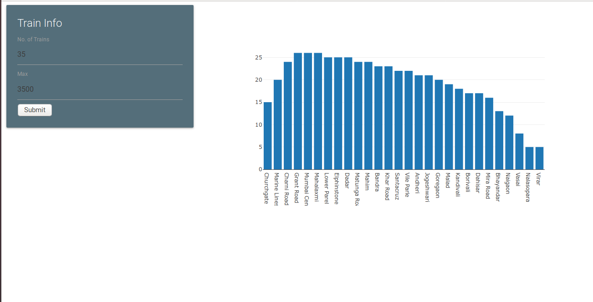
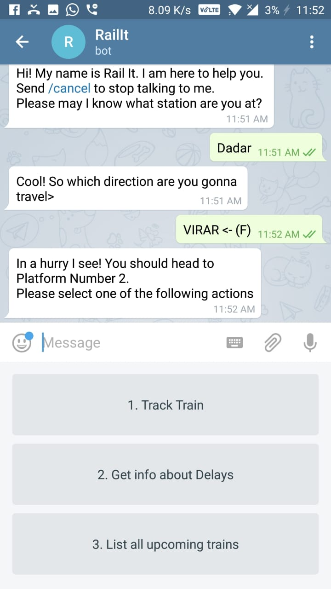
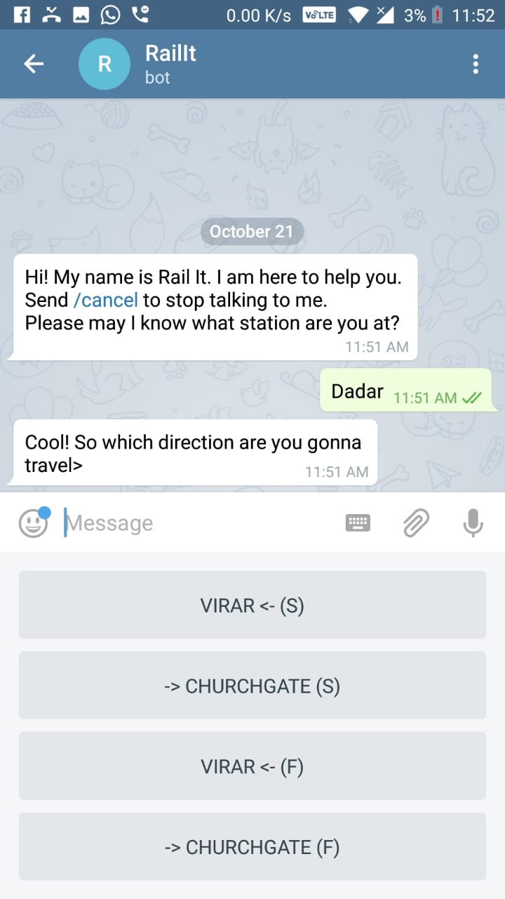

<h1 align = "center">Rail.it</h3>
<h3 align="center">Optimized Railway Time Table Simulation</h3>

 

------------------------------------------

>Trains are the lifeline of Mumbai and the Mumbai Suburban Rail network is used by millions daily. This lifeline is howerver, choked and overcrowded and trains run over-capacity regularly. We've built a `Optimized Railway Time Table Scheduler` which automatically gives an optimized railway timetable, which tries to minimize the crowding and maximize train utilization.

------------------------------------------
### Features

- `Railway Admin Dashboard` where the live positions of all the trains are shown.
- `Simulation` where a given schedule can be tested and verified
- `Optimal Time Table Generation` to minimize crowding in each train and maximize utilization 

------------------------------------------

 

 

 

 

------------------------------------------

### Add-Ons

- [ ] Chatbot for the users to know the live location of any train and to notify them about any delays which may be there. 
- [ ] Add More

------------------------------------------
### Contributing
 We're are open to `enhancements` & `bug-fixes` :smile: Also do have a look [here](./CONTRIBUTING.md)

### Note

 This project was done under `24 hours with minimal pre-preparation`

------------------------------------------
### Contributors

- [@Korusuke](https://github.com/Korusuke)
- [@Rusherrg](https://github.com/RusherRG)
- [@akshay-99](https://github.com/akshay-99)
- [@vedant-shroff](https://github.com/vedant-shroff)
- [@aditya1999](https://github.com/aditya1999)

------------------------------------------

This repository / project was a part of Enroot Mumbai Hackathon 2018
